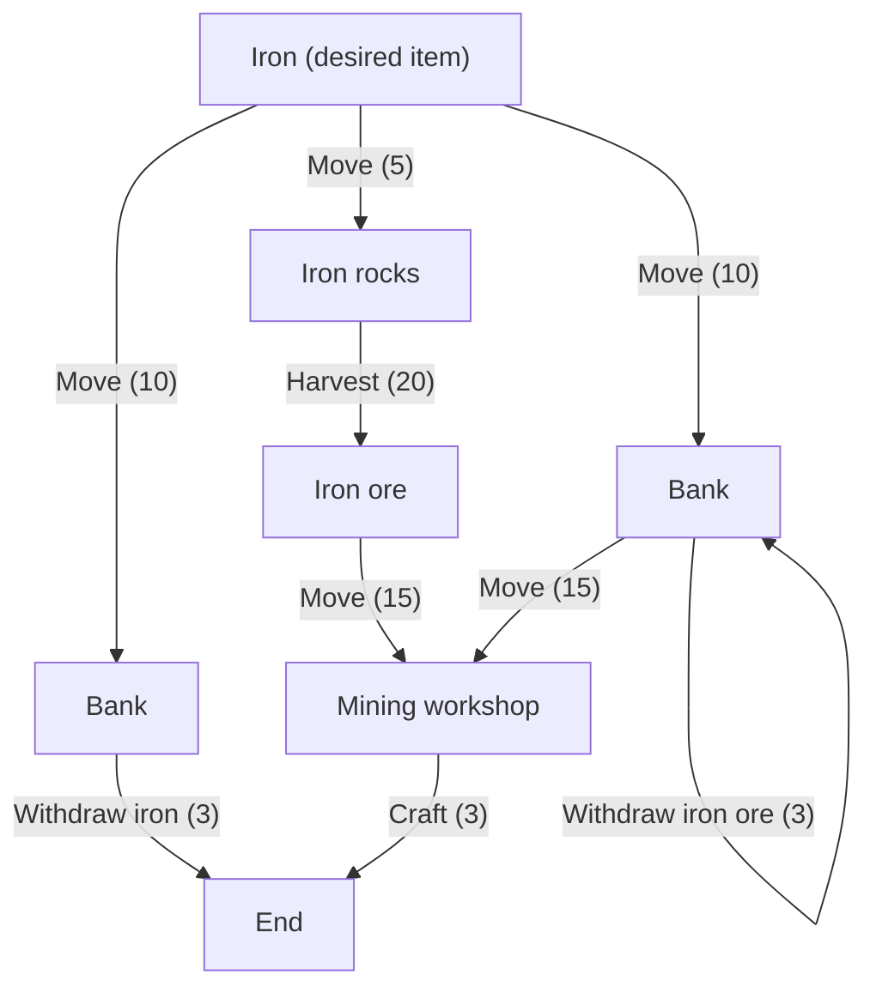

A plan consists of nodes and edges.
A node is a "thing" and an edge is an "action".
Examples of nodes are things like [item, monster, resource, location]
Examples of actions are things like (harvest, craft, move, fight)

Nodes without actions are terminal nodes and indicate the end.

A plan should be built to consider all possibilities when it is built.
This should also consider different permutations of actions that can be taken.
Each sibling action to another action is a different possible action.
This is so that we can calculate weights between all actions and pick the best one to execute.

The lowest possible weighted path through the graph will be the best one to choose, so lower weights
indicate faster things and higher weights indicate slower things.
A large quantity of things to be harvested will increase the rate, so will a low drop rate chance on the thing we want.
Likewise, moving to a far away destination takes time (based on distance) so it will have a high weight too.

Nodes with multiple actions should pick one of the available actions to perform.
